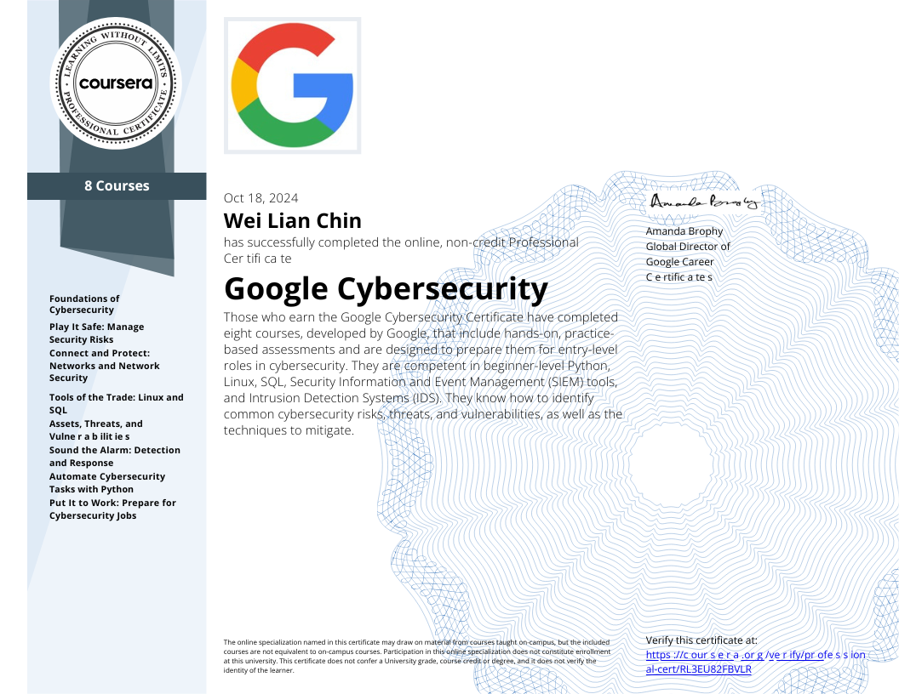
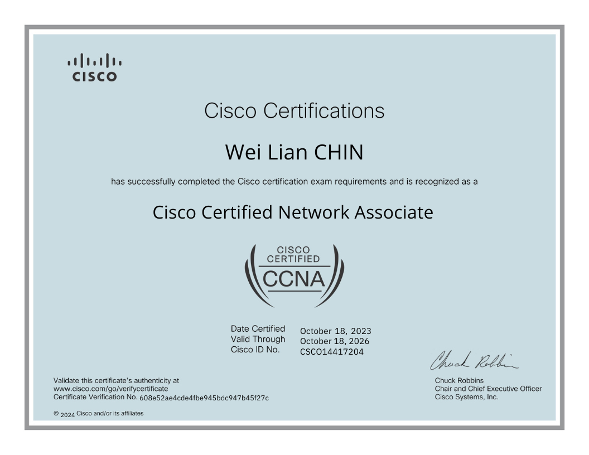

# Certificates
<section id="certificates">

  

    

	  
      

        <h3>Google Cybersecurity Certificate</h3>
        
Issued by: Coursera

      

    

    

	  
      

        <h3>CCNA (Cisco Certified Network Associate)</h3>
        
Issued by: Cisco

      

    

    <!-- Add more certificates as needed -->
  

</section>

